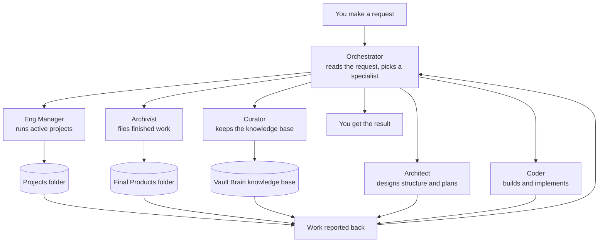

# How This Repo Works

This project is a personal assistant system built from AI "agents" that each have one job. You make a request, a central Orchestrator figures out who should handle it, and that specialist works only inside its own folder before reporting back. Think of it like a small office: one manager, five specialists, three filing cabinets.

To view this diagram: it renders automatically when this file is viewed on GitHub, or paste the code block above into https://mermaid.live.
